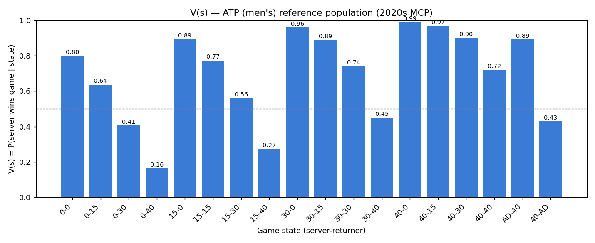
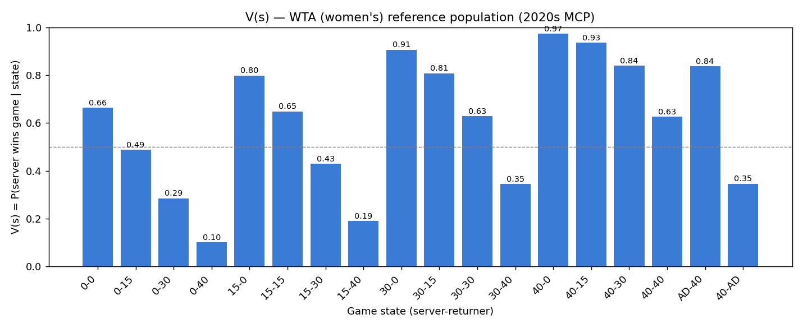
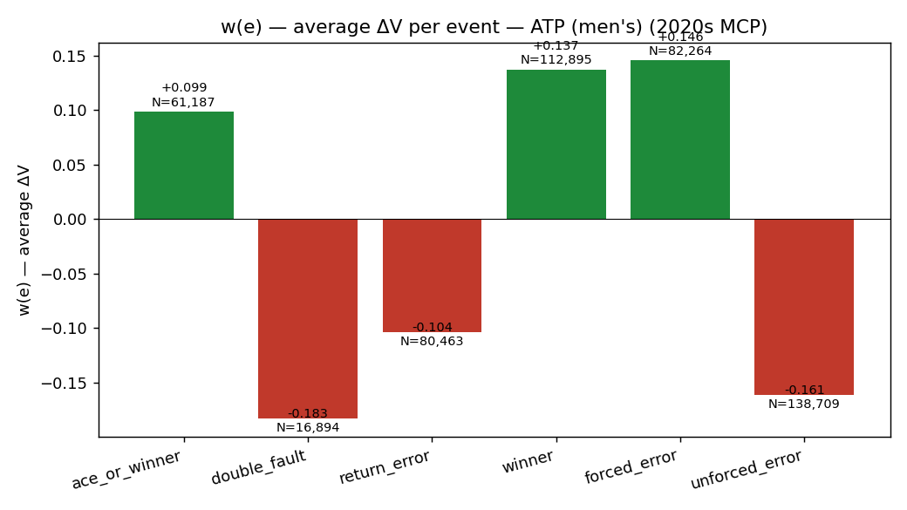
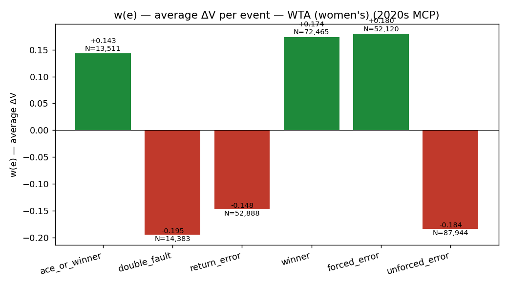
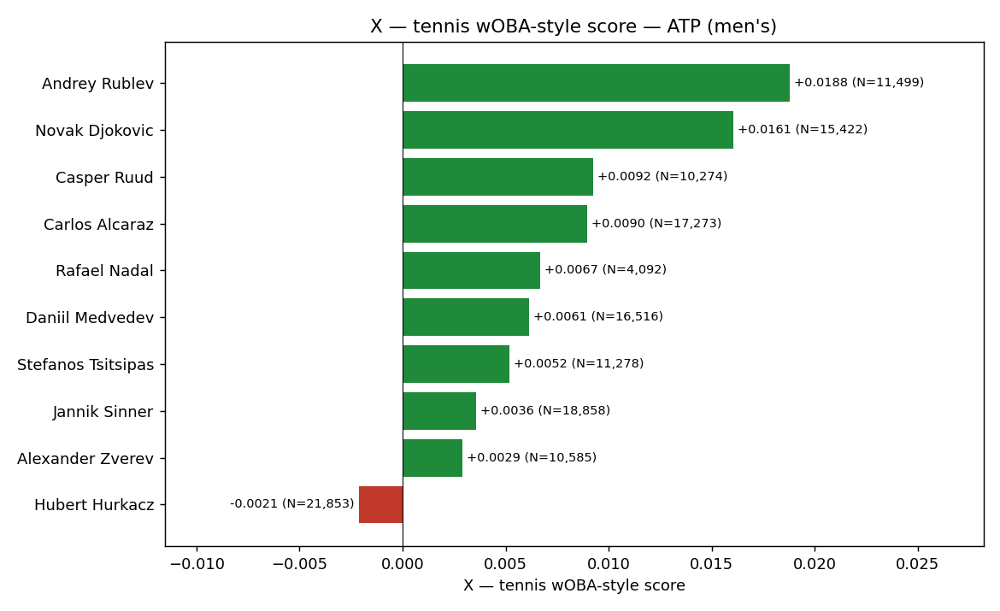
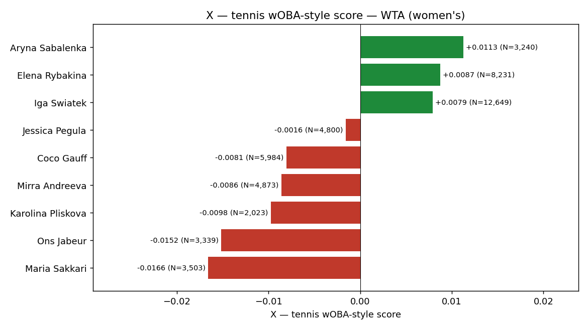

# CS 682 Project — Tennis wOBA-style Metric

A tennis adaptation (Weighted On-Base Average).
Every point-ending event (ace, winner, error, double fault, …) is
weighted by *how much it changed the server's probability of winning the
current game*, and those weighted values are averaged across all of a
player's points to produce a single overall-performance score **X**.

The metric inherently rewards "clutch" play because winning a tough
30-30 point moves the win-probability needle more than winning a 40-0
point.  To my knowledge no public tennis wOBA exists in the
sabermetrics-style literature, which is the angle our customer/instructor
proposed.

---

## TL;DR — Results

Reference population: **Match Charting Project** point-by-point data
from the **2020s** (494,150 ATP points across 7,194 matches; 294,583
WTA points across 3,824 matches).  Tiebreak points are excluded.

### Step 1 — V(s): server's probability of winning the game




| State | V (ATP) | V (WTA) |
|------:|:-------:|:-------:|
| 0-0   | 0.798   | 0.664   |
| 15-0  | 0.892   | 0.798   |
| 0-15  | 0.637   | 0.488   |
| 30-30 | 0.742   | 0.628   |
| 40-0  | 0.990   | 0.972   |
| 0-40  | 0.165   | 0.101   |
| 40-40 (deuce) | 0.719 | 0.626 |
| AD-40 | 0.891   | 0.837   |
| 40-AD | 0.429   | 0.346   |

The ATP–WTA gap at every state (≈ 0.13 at 0-0) reproduces the
well-known fact that men hold serve more often than women.

### Step 2 — w(e): average ΔV per event type




| Event              | w (ATP)  | N (ATP) | w (WTA)  | N (WTA) |
|--------------------|:--------:|:-------:|:--------:|:-------:|
| ace_or_winner      | **+0.099** | 61,187  | **+0.143** | 13,511  |
| double_fault       | **−0.183** | 16,894  | **−0.195** | 14,383  |
| return_error       | **−0.104** | 80,463  | **−0.148** | 52,888  |
| winner             | **+0.138** | 112,895 | **+0.174** | 72,465  |
| forced_error drawn | **+0.146** | 82,264  | **+0.180** | 52,120  |
| unforced_error     | **−0.161** | 138,709 | **−0.184** | 87,944  |

Signs and magnitudes pass the sniff test: unforced errors are the
biggest *negative*, winners and forced-errors-drawn the biggest
*positive*, with double faults a close runner-up among negatives.

### Step 3 — X: player overall-performance score




| ATP player          | X        | N      |   | WTA player        | X        | N      |
|---------------------|:--------:|:------:|:-:|-------------------|:--------:|:------:|
| Andrey Rublev       | +0.0188  | 11,499 |   | Aryna Sabalenka   | +0.0113  | 3,240  |
| Novak Djokovic      | +0.0161  | 15,422 |   | Elena Rybakina    | +0.0087  | 8,231  |
| Casper Ruud         | +0.0092  | 10,274 |   | Iga Swiatek       | +0.0079  | 12,649 |
| Carlos Alcaraz      | +0.0090  | 17,273 |   | Jessica Pegula    | −0.0016  | 4,800  |
| Rafael Nadal        | +0.0067  | 4,092  |   | Coco Gauff        | −0.0081  | 5,984  |
| Daniil Medvedev     | +0.0061  | 16,516 |   | Mirra Andreeva    | −0.0086  | 4,873  |
| Stefanos Tsitsipas  | +0.0052  | 11,278 |   | Karolina Pliskova | −0.0098  | 2,023  |
| Jannik Sinner       | +0.0036  | 18,858 |   | Ons Jabeur        | −0.0152  | 3,339  |
| Alexander Zverev    | +0.0029  | 10,585 |   | Maria Sakkari     | −0.0166  | 3,503  |
| Hubert Hurkacz      | −0.0021  | 21,853 |   |                   |          |        |

The leaderboards are dominated by the players most observers would call
elite. Values are small because per-point ΔV is small in absolute
terms — what matters is the **sign** and **relative ordering**.

---

## Methodology

For every point we record:

* **s_before** — game state right before the point (one of 18
  non-terminal states: `0-0`, `0-15`, … , `40-40`, `AD-40`, `40-AD`).
* **s_after** — game state right after the point.  If the point ends
  the game, `s_after` is a terminal state worth `V = 1` (server won)
  or `V = 0` (returner won).
* **E(j)** — the point-ending event type:
  * `ace_or_winner` — ace or service winner (no return in play).
  * `double_fault` — both serves out.
  * `return_error` — error on the return shot only.
  * `winner` — rally winner including return winner.
  * `forced_error` — forced error drawn (credited to the drawer).
  * `unforced_error` — unforced error during the rally.

We then compute

```
V(s)   = #(games server won from state s) / #(times state s occurred)

ΔVⱼ    =  V(s_after) - V(s_before)            if E(j) is recorded by the server
       =  V(s_before) - V(s_after)            if E(j) is recorded by the returner

w(eᵢ)  = mean of ΔVⱼ over all points whose event is eᵢ

X(p)   = (1/N) Σᵢ w(eᵢ) · Cᵢ
         where Cᵢ is the count of player p's points classified as eᵢ
         and  N = Σᵢ Cᵢ
```

The MCP shot-string codes (e.g. `4f37b1f3*` means
"serve wide → forehand return cross-court deep → server backhand
down-the-line → returner forehand winner") are parsed by
[`classify_event`](Project.py#L100) into the 6 event types above,
which classifies 99.6% of regular-game points.

---

## Repository layout

```
Project.py        # all code (parser, V, w, X, plots, self-test)
tennis.pdf        # summary of the project
output/
  V_states_m.csv  V_states_m.png
  V_states_w.csv  V_states_w.png
  w_events_m.csv  w_events_m.png
  w_events_w.csv  w_events_w.png
  X_players_m.csv X_players_m.png
  X_players_w.csv X_players_w.png
README.md
```


Grab it from the upstream sources below and drop the folders next to
`Project.py`.

## Data sources

* **Match Charting Project** (shot-by-shot point data, used here):
  <https://github.com/JeffSackmann/tennis_MatchChartingProject>
  License: CC BY-NC-SA 4.0 by Jeff Sackmann.
* **Tennis point-by-point** (additional reference, not used in the
  current pipeline):
  <https://github.com/JeffSackmann/tennis_pointbypoint>


## Running the pipeline

Requirements: Python ≥ 3.10, pandas, numpy, matplotlib.

```bash
python3 Project.py          # ATP (men's), default
```

A self-test (12 parser unit tests + an end-to-end mini-game) runs first
on every invocation.  CSVs and PNGs are written into `output/`.


**Course:** CS 682, Spring 2026
